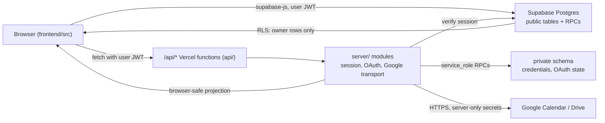

# Architecture

orbitOS has two data paths. Ordinary workspace records go from the browser
straight to Supabase Postgres under row-level security. Anything that needs a
Google credential goes through a Vercel function, which runs server-only code and
never exposes the credential to the browser.

## Path 1: browser to Supabase

Todos, projects, ideas, home appearance, classes, and notes are read and
written by `supabase-js` in the browser using the signed-in user's JWT. Class
assignments are todos with a `class_id`; the Classes page reads and writes them
through an adapter over the todo service (see
[task aggregation](history/TASK_AGGREGATION_ROADMAP.md)). There is no application
server in this path. Every table has RLS policies and column-scoped grants, so
the browser cannot read another account's rows or write protected lifecycle
columns. Multi-row atomic work (Today ordering, soft
delete, restore, search) happens in `public` RPCs that wrap `internal` helpers
owned by the `orbitos_rpc` role. See
[workspace data model](WORKSPACE_DATA_MODEL.md) and
[ADR 0001](adr/0001-rls-only-browser-access.md).

## Path 2: browser to /api to Google

Calendar and Drive need a Google refresh token, a client secret, and an
encryption key. Those never reach the browser. The browser calls `/api/...` with
its Supabase JWT; the function verifies the session through Supabase Auth,
reads the encrypted credential through `service_role` RPCs, talks to Google, and
returns a sanitized projection. Provider bodies, attendees, descriptions, and
tokens stay out of the response. See [Calendar](CALENDAR.md) and
[Drive](DRIVE.md).

## Where code lives

| Location | Contents |
| --- | --- |
| `frontend/src/apps/` | Application entry points and the workspace shell runtime: `CloudApp`, `MainWorkspace`, `WorkspaceRuntime`, the OAuth callback pages, and the navigation cache. |
| `frontend/src/features/` | One folder per feature area (`todos`, `collections`, `calendar`, `classes`): components, their CSS, the Supabase-backed service, and pure domain/model helpers. |
| `frontend/src/components/` | Cross-feature UI: the app shell, global add, search. Legacy-only components also still live here. |
| `frontend/src/auth/` | Session restore, Google app sign-in, provider-safe storage, and the `RequireAuth` gate. |
| `frontend/src/config/` | Browser environment parsing, runtime mode, and Vite config helpers. |
| `frontend/src/qa/` | Development-only fixtures. See [QA fixtures](QA_FIXTURES.md). |
| `frontend/src/types/` | Generated `database.ts` and hand-written `domain.ts` browser contracts. |
| `api/` | Vercel function entry points only: one `[action].ts` per Google provider (`calendar/`, `drive/`) so a warm instance serves every action, the agent resource, and `health.ts`. Each parses the request and delegates. |
| `server/` | Server-only logic: session verification, OAuth policy, token encryption, Google transports, and environment validation. Never imported by browser code. |
| `shared/` | Contracts used by both sides: calendar event shapes, Today RPC wire names, Supabase environment normalizers. Must stay dependency-free and runtime-neutral. |
| `supabase/` | `migrations/` (forward-only schema) and `tests/` (pgTAP). |
| `tests/contract/` | Node/PGlite tests that run everywhere, including CI, with no Docker. |
| `tests/local/` | Tests that require local Supabase in Docker. Not run in CI. |
| `scripts/` | Node check scripts invoked by npm scripts: browser secret scan, local Todo HTTP suite, OAuth concurrency suite, migration rewind. |

## Where new code goes

- Does it need a secret? If yes it belongs in `server/`, with a thin `api/`
  entry point. If no, it belongs in `frontend/src/features/<area>/`.
- Does the browser and the server both need to agree on a shape or a wire name?
  Put the type or constant in `shared/`.
- Is it a pure function over data (dates, layout, formatting, validation)? Put it
  in its feature folder as a `*.ts` module with a sibling unit test, not inside a
  component.
- Does it change the schema? Add a migration under `supabase/migrations/` plus a
  pgTAP file under `supabase/tests/`. See
  [ADR 0003](adr/0003-forward-only-hosted-migrations.md).
- `frontend/src/api/client.ts` is legacy FastAPI transport. Do not add to it.

## How the QA fixture relates to real services

`WorkspaceRuntime` receives its services as props: `todoService`,
`collectionService`, `calendarService`, `driveService`, and `workspaceData`.
The authenticated app passes Supabase-backed implementations; the fixture passes
in-memory ones with the same interfaces. The pages, navigation cache, preload,
and invalidation are identical. The fixture proves layout, interaction, and
error handling. It cannot prove RLS, persistence, OAuth, or Google behavior.
See [QA fixtures](QA_FIXTURES.md).

## Testing layers

| Layer | Runs | Command | Proves |
| --- | --- | --- | --- |
| Unit and component | Vitest, `node` by default with `// @vitest-environment happy-dom` per DOM file | `npm test` | Component behavior, pure domain logic, service mapping against fakes. |
| Contract | Vitest; SQL cases run against embedded PostgreSQL (PGlite) | `npm test` | Migration and RPC logic, OAuth policy, transports, server session handling, no Docker required. |
| pgTAP | Real Postgres in local or CI Supabase | `npm run db:test` | RLS isolation, role and ACL posture, function behavior on the real engine. |
| Local integration | Local Supabase over HTTP | `npx vitest --config vitest.local.config.ts`, plus `db:test:todos-http` and `db:test:oauth-concurrency` | PostgREST row limits, real Auth/JWT reads, concurrency. Not run in CI. |

Details and when each suite runs are in
[cloud development](CLOUD_DEVELOPMENT.md).

## Personal agent API

`/api/agent/v1/[resource]` is one Vercel function for scheduled agent clients.
`server/agent/` verifies a dedicated bearer token, configured scopes, and a fixed
server-bound user UUID. Workspace requests use service-only wrappers around
RLS-constrained `orbitos_agent` functions; explicit field allowlists, opaque
versions, idempotent writes, and a private journal protect the shared records.
Google operations reuse the existing transports with that trusted identity.
See [Agent API](AGENT_API.md) for endpoint contracts and server configuration.
